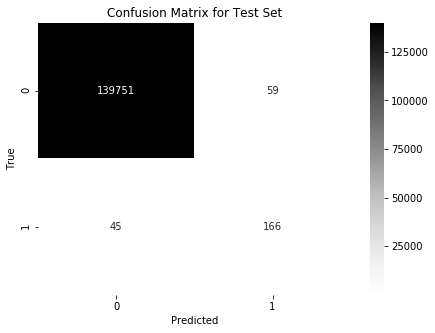

# Credit Card Fraud Detection
#### Rafael Buck

## Histórico do assunto
Fraudes financeiras são uma ameaça cada vez maior no setor financeiro e Data Science e Machine Learning vêm desempenhando um papel 
imperativo na detecção de fraude em transações on-line. Por exemplo, uma pesquisa da PwC, de crimes econômicos globais de 2016, 
indica que aproximadamente 36% das organizações sofreram com crimes econômicos. No entanto, a tarefa de detecção de fraude muitas 
vezes ainda se resume a detecção de valores aberrantes, em que um conjunto de dados é digitalizado para encontrar possíveis anomalias 
nos dados.

A detecção de fraude em cartões de crédito, portanto, torna-se desafiadora devido a dois motivos: em primeiro lugar, os perfis de 
comportamentos normais e fraudulentos mudam constantemente; e, em segundo lugar, os conjuntos de dados de fraude de cartão de crédito 
são altamente distorcidos. O desempenho da detecção de fraude em transações de cartão de crédito é muito afetado pela abordagem de 
amostragem no conjunto de dados, seleção de variáveis e técnica (s) de detecção utilizada. Em complemento ao exposto acima, a motivação 
para realização desse trabalho é a relevância para aprimorar conhecimentos na área de cibersegurança. 

## Solução encontrada (Detecção de 80% de transações fraudulentas em cenário real de operação)
O problema de Detecção de Fraude em Cartões de Crédito consiste na modelagem de transações passadas de cartão de crédito, em função 
de um conjunto de atributos que a definem, e com o conhecimento daquelas que resultaram ser fraude. É, portanto, um problema de 
aprendizagem supervisionada, onde busca-se prever quais transações potencialmente são fraudulentas, prioritariamente minimizando-se 
falsos positivos (maximizando-se, portanto, verdadeiros positivos).

Ao final de nossas análise, podemos afirmar que encontramos um classificador que identifica, em cenário real, 4 a cada 5 transações fraudulentas (aproximadamente 80% de transações fraudulentas, target `1`), com uma quantidade muito pequena de falsos positivos.



Com esses resultados é possível analisar que o estimador final:
- gera pouco mais de 20% de falsos negativos;
- gera pouco mais de 25% de falsos positivos.

Se comparado com outros modelos encontrados na Internet para o mesmo dataset, esses resultados são surpreendentemente bons. Enquanto que em algumas análises se encontrou um Recall de 0.61-0.63, nossa análise atingiu um Recall de 0.79. Outro trabalho muito bom desenvolvido em R atingiu valores médios de AUPRC de 0.95-0.96, o nosso modelo atinge médias de 0.96-0.97 para situação similar.

Isso foi possível pela estratégia de solução que selecionamos ao longo de nossa análise, que consistiu em:
- **não remover nenhum *outlier***: verificamos que era melhor para o modelo mantê-los;
- **dividir as transações em dois dias**: as amostras do primeiro dia para fazer o modelo (50% dos dados para treino e 50% para teste, com *grid search* e seleção inteligente de *features*); e as amostras do segundo dia para testar o modelo final obtido (modelo calibrado);
- **AUC final no conjunto de testes**: 0.8932.
- **classificador final**: XGBoost Classifier com os parâmetros {'subsample': 1.0, 'learning_rate': 0.5, 'max_depth': 5}

        XGBClassifier(base_score=0.5, booster='gbtree', colsample_bylevel=1,
           colsample_bytree=1, gamma=0, learning_rate=0.5, max_delta_step=0,
           max_depth=5, min_child_weight=1, missing=None, n_estimators=100,
           n_jobs=1, nthread=None, objective='binary:logistic', random_state=0,
           reg_alpha=0, reg_lambda=1, scale_pos_weight=1, seed=None,
           silent=True, subsample=1.0))])

### Instalação
Este projeto requer **Python 3.5** e as seguintes bibliotecas Python instaladas:

- [NumPy](http://www.numpy.org/)
- [Pandas](http://pandas.pydata.org/)
- [scikit-learn](http://scikit-learn.org/stable/)
- [XGBoost](http://xgboost.readthedocs.io/en/latest/get_started/index.html#python)

Você também precisará ter software instalado para rodar e executar um [iPython Notebook](http://ipython.org/notebook.html)

### Execução
Em um terminal ou janela de comando, navegue até o diretório raiz de projeto e execute os seguintes comandos:

```ipython notebook Credit_card_fraud_detection.ipynb```  
```jupyter notebook Credit_card_fraud_detection.ipynb```

Isso abrirá o o software e arquivo de projeto Jupyter Notebook em seu navegador.

## Dados
O Dataset contém transações realizadas com cartões de crédito em setembro de 2013 pelos detentores de cartão europeus. Este conjunto de dados apresenta transações ocorridas em dois dias, onde temos 492 fraudes de 284.807 transações. Os dados usados neste projeto estão incluídos em `creditcard.csv`. O conjunto de dados pode ser baixado em https://www.kaggle.com/mlg-ulb/creditcardfraud/data.
